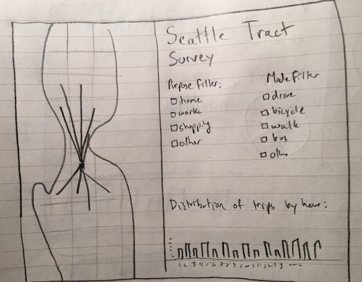

# a3-dbabbs-debricassart

## Team Members

1. Philippe Vaillant (vaillant)
2. Dylan Babbs (dbabbs)

## Visualizing Seattle Trips

For Assignment 3, we decided to visualize trips throughout the Seattle area from the [2014 Puget Sound Regional Travel Study](http://www.psrc.org/data/transportation/travel-surveys/2014-household). The dataset, compiled from household responses throughout King, Kitsap, Pierce, and Snohomish counties, was created during the Spring of 2014 by the Puget Sound Regional Council. The dataset contains 47,919 records of trips compiled from a combination of nearly 6,000 households. We decided to focus on records within the city of Seattle (instead of the entire Puget Sound region) for simplicity.

The visualization highlights the different travel paths of residents throughout US Cencus tracts of the city. Each path's weight between different tracts is determined based on the number of records. For example, a popular route such as U-District to Downtown will have a fairly thick line weight. In the second column of the page, a bar graph is present showing the distribution of trip times throughout the day by hour. Both the paths on the map and the bar graph can be filtered by mode of transportation and purpose of trip using checkboxes below the title and description.

## Running Instructions

Access our visualization at http://cse512-16s.github.io/a3-dbabbs-debricassart or download this repository and run `python -m SimpleHTTPServer 8888` and access this from http://localhost:8888/.

## Story Board

### Changes between Storyboard and the Final Implementation

First storyboard design. All elements remain intact in the final visualization except for the donut chart visualizing the purpose of trip.

Final storyboard design. Donut chart was removed as well as some repositioning of elements. Map was repositioned to take over the entire left half of the frame, while the bar graph was repositioned on the bottom half of the right half of the frame. This repositioning was performed to place a greater emphasis on the main element of the visualization: the map.

## Development Process

1. **Deciding which dataset to use**. We were both interested in visualizing either urban, travel, or transportation data. We considered using [Seattle Metro GTFS data](http://metro.kingcounty.gov/gtfs/), [Pronto bike share usage data](https://www.prontocycleshare.com/datachallenge), and [Seattle parking data](http://wwwqa.seattle.gov/transportation/parking/appinfo.htm). We chose to visualize Puget Sound Regional Travel Survey because we were curious about the most popular travel destinations throughout Seattle and due to the large number of records within the dataset. We ended up using the 2014 survey instead of the more recent 2015 survey because the 2014 version had more records in the dataset. (1.5 hours)

2. **Creating the storyboard and wireframe**. After choosing the dataset, we decided to create a storyboard that answered some of our questions we had about the survey results. What are the most popular trip destinations throughout the city? What hours throughout the day are most people traveling? What are the most popular modes of transportations. What are the most common purposes for transportation: home, work, shopping? We chose to incorporate a map of Seattle visualizing routes between Cencus tracts via mouse hover, a bar graph of the distribution of trips by hour of the day, and filters to explore different modes of transportation and purpose of trip. (1.5 hours)

3. **Preparing and transforming the data**. In order to visualize the data in D3.js using paths between land tracts, we had to transform our data into the proper form. Using an R script, we aggregated all similar rows of destination tract, origin tract, mode, purpose, and time by count. The R script also removed nearly 80 other unnecessary columns from the dataset. Within the dataset, the purpose and mode columns values were integers which corresponded to string values in a lookup file. We created a separate Java script to change the integer values to their string full names. The reason for using two different files is that we did these scripts at different times. In addition, we had to download US Census tracts within Seattle boundaries from the [Open Seattle Organization](https://github.com/openseattle/seattle-boundaries/blob/master/data/census-tracts.geojson). (3 hours)

4. **Creating HTML frame and simple visualizations**. We chose to code our HTML frame, map tile and trips by hour bar graphs initially before creating our more advanced features (filters and paths). Our first frame was a weak HTML skeleton, but after a few passes, we changed our frame to bootstrap for pre-styled items and a mobile-friendly site in case our visualization consumers were on their mobile device. We chose to the HERE Map Tile API overlay within Leaflet.js. Dylan chose HERE Maps over OpenStreetMaps for a personal bias (employer!). We then coded a bar graph with the number of trips per hour. (4 hours)

5. **Creating paths between Cencus tracts**. (12 hours)

6. **Filtering by purpose and mode**. Using JQuery, we assigned actions to checkboxes in order to filter by mode or purpose. The JQuery script would call on a method to update the data of the bar chart and paths with the parameters checked by the user. (10 hours)

7. **Writing writeup and finalizing project**. Yes, this was a step in the project. (2 hours)

Distribution of work:
*Philippe: data exploration, data prep, geojson prep, mapping, paths, filtering, information pane/tooltip.
*Dylan: data exploration, data prep, HTML front end, mapping tile, bar graph, write up.
